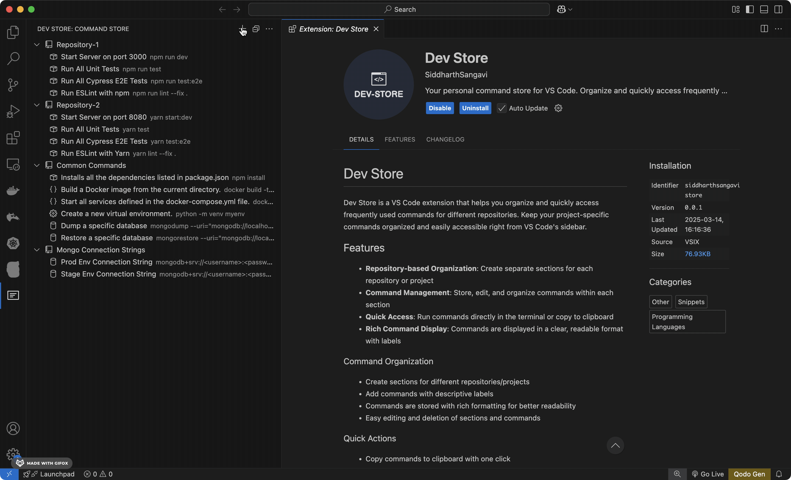
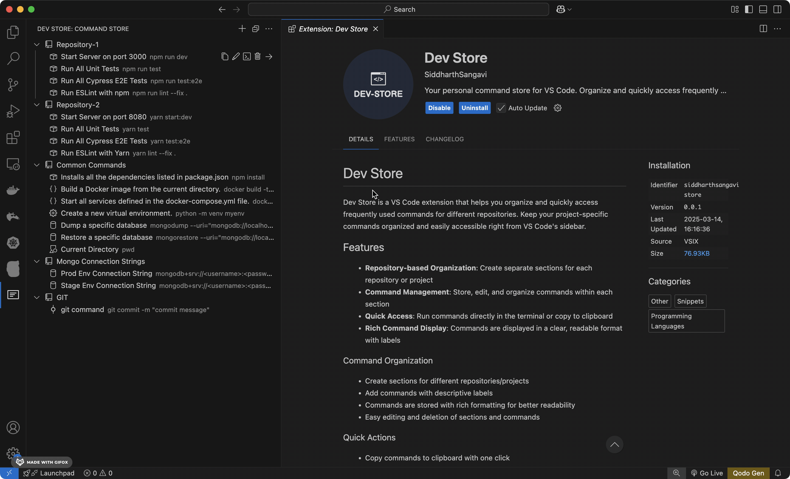

# Dev Store

Dev Store is a VS Code extension that helps you organize and quickly access frequently used commands for different repositories. Keep your project-specific commands organized and easily accessible right from VS Code's sidebar.

## Features

- **Repository-based Organization**: Create separate sections for each repository or project
- **Command Management**: Store, edit, and organize commands within each section
- **Quick Access**: Run commands directly in the terminal or copy to clipboard
- **Rich Command Display**: Commands are displayed in a clear, readable format with labels
- **Terminal Icons**: Add commands as clickable icons directly in the terminal area

### Command Organization

- Create sections for different repositories/projects
- Add commands with descriptive labels
- Commands are stored with rich formatting for better readability
- Easy editing and deletion of sections and commands

### Quick Actions

- Copy commands to clipboard with one click
- Run commands directly in the integrated terminal
- Edit commands and sections inline
- Delete items with confirmation for safety
- Use file placeholders in commands that get replaced with active file information
- Add commands as persistent terminal icons for one-click access

## Features in Action

### Creating Sections and Commands

Create new sections for your repositories and add commands with descriptive labels.

### Running Commands in Terminal

Execute your stored commands directly in the integrated terminal with a single click.

## Usage

1. Click the Dev Store icon in the activity bar to open the sidebar
2. Click the "+" button to create a new section for your repository
3. Select a section and click the "+" button to add a command
4. Use the inline buttons to:
   - Edit items (pencil icon)
   - Delete items (trash icon)
   - Copy commands (copy icon)
   - Run commands in terminal (terminal icon)
   - Add commands to terminal (plus icon)

### Terminal Icons

Commands can be added as clickable icons that stay visible in the terminal area:

1. Right-click on any command in the sidebar and select "Add to Terminal"
2. The command will appear as an icon in the status bar
3. Click on the icon to execute the command
4. Click on the "Terminal Icons" kebab menu to:
   - Manage existing icons
   - Remove icons
   - Change icon appearances

### File and Environment Placeholders

When creating or editing commands, you can use the following placeholders:

#### File Placeholders

- `{filename}` - The filename with extension (e.g., "app.js")
- `{filepath}` - Full file path of active editor (e.g., "/path/to/your/app.js")

#### Environment Variables

- `{env:VARIABLE_NAME}` - Value from your project's .env file (e.g., `{env:PORT}`)

Example usage:

- Run server on specific port: `node server.js --port {env:PORT}`
- Connect to database: `psql -h localhost -p {env:DB_PORT} -U {env:DB_USER} {env:DB_NAME}`
- Run tests with custom config: `jest {filepath} --config {env:TEST_CONFIG}`

The extension will automatically:

1. Look for a .env file in your workspace root
2. Replace any `{env:VARIABLE}` placeholders with values from the .env file
3. Show a warning if a referenced environment variable is not found

### Example Commands Using File Placeholders

Here are some common use cases and how to store them in Dev Store:

1. Running tests for specific file:

   - Label: "Test Current File"
   - Command: `npm test {filepath}`
     or
   - Label: "Test File (Jest)"
   - Command: `jest {filename}`

2. Running TypeScript compilation:

   - Label: "Compile Current File"
   - Command: `tsc {filepath}`

3. Running ESLint:

   - Label: "Lint Current File"
   - Command: `eslint {filepath}`
   - Label: "Fix Lint Issues"
   - Command: `eslint --fix {filepath}`

4. Running Python scripts:

   - Label: "Run Python File"
   - Command: `python {filepath}`

5. Running specific test suites:
   - Label: "Run Test Suite"
   - Command: `mocha {filepath}`

When you run these commands, the placeholders will be automatically replaced with:

- `{filename}`: just the file name (e.g., "MyComponent.tsx")
- `{filepath}`: full path to the file (e.g., "/Users/project/src/components/MyComponent.tsx")

## Requirements

- Visual Studio Code version 1.80.0 or higher

## Extension Settings

This extension currently stores all data in VS Code's global storage and doesn't require any additional configuration.

## Known Issues

If you find any issues, please report them at [https://github.com/SiddarthSangavi/Dev-Store/issues](https://github.com/SiddarthSangavi/Dev-Store/issues)

## Release Notes

### 2.1.0

- Added terminal icons feature for quick command access from the status bar
- Command icons can now be customized
- Improved command management

### 2.0.0

Initial release of Dev Store:

- Basic section and command management
- Copy to clipboard functionality
- Run in terminal functionality
- Rich command display
